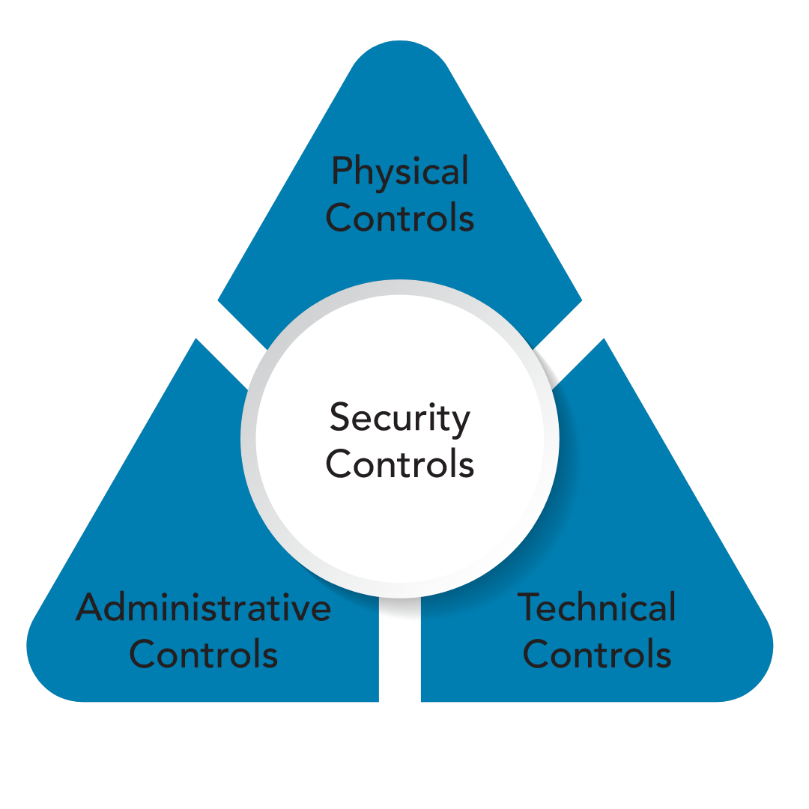

# Módulo 3: Comprender los controles de seguridad

## ¿Qué son los controles de seguridad?

Los controles de seguridad se refieren a los mecanismos físicos, técnicos y administrativos que actúan como salvaguardas o contramedidas prescritas para un sistema de información para proteger la confidencialidad, integridad y disponibilidad del sistema y su información. La implementación de controles debería reducir el riesgo, con suerte a un nivel aceptable.

### Controles físicos

Los controles físicos abordan las necesidades de seguridad basadas en procesos utilizando dispositivos de hardware físico, como lectores de tarjetas, características arquitectónicas de edificios e instalaciones y acciones de seguridad específicas que deben tomar las personas. Por lo general, brindan formas de controlar, dirigir o prevenir el movimiento de personas y equipos en una ubicación física específica, como una oficina, una fábrica u otra instalación. Los controles físicos también brindan protección y control sobre la entrada al terreno que rodea los edificios, estacionamientos u otras áreas que están bajo el control de la organización. En la mayoría de las situaciones, los controles físicos están respaldados por controles técnicos como un medio para incorporarlos a un sistema de seguridad general.

Los visitantes e invitados que acceden a un lugar de trabajo, por ejemplo, a menudo deben ingresar a las instalaciones a través de una entrada y salida designadas, donde pueden ser identificados, se puede evaluar el propósito de su visita y luego se les permite o deniega la entrada. Los empleados ingresarían, quizás a través de otras entradas, utilizando credenciales emitidas por la empresa u otros tokens para afirmar su identidad y obtener acceso. Estos requieren controles técnicos para integrar los lectores de tarjetas o fichas, los mecanismos de apertura de puertas y los sistemas de gestión de identidad y control de acceso en un sistema de seguridad más fluido. " Atrás

### Controles técnicos

Los controles técnicos (también llamados controles lógicos) son controles de seguridad que los sistemas informáticos y las redes implementan directamente. Estos controles pueden brindar protección automatizada contra el acceso no autorizado o el uso indebido, facilitar la detección de violaciones de seguridad y respaldar los requisitos de seguridad para aplicaciones y datos. Los controles técnicos pueden ser ajustes de configuración o parámetros almacenados como datos, administrados a través de una interfaz gráfica de usuario (GUI) de software, o pueden ser ajustes de hardware realizados con interruptores, puentes u otros medios. Sin embargo, la implementación de controles técnicos siempre requiere importantes consideraciones operativas y debe ser coherente con la gestión de la seguridad dentro de la organización. Muchos de estos serán examinados con mayor profundidad a medida que los analicemos en secciones posteriores de este capítulo y en capítulos posteriores.

### Controles administrativos

Los controles administrativos (también conocidos como controles gerenciales) son directivas, lineamientos o avisos dirigidos a las personas dentro de la organización. Proporcionan marcos, restricciones y estándares para el comportamiento humano, y deben cubrir todo el alcance de las actividades de la organización y sus interacciones con partes externas y partes interesadas. 

Es de vital importancia darse cuenta de que los controles administrativos pueden y deben ser herramientas poderosas y efectivas para lograr la seguridad de la información. Incluso las políticas de concientización sobre seguridad más simples pueden ser un control efectivo, si puede ayudar a la organización a implementarlas completamente a través de capacitación y práctica sistemáticas.

Muchas organizaciones están mejorando su postura de seguridad general mediante la integración de sus controles administrativos en las actividades a nivel de tarea y los procesos de decisión operativa que su fuerza laboral utiliza a lo largo del día. Esto se puede hacer brindándolos como recursos de consulta y referencia listos en contexto, o vinculándolos directamente a las actividades de capacitación. Estas y otras técnicas llevan las políticas a un nivel más neutral y lejos de la toma de decisiones de los altos ejecutivos. También los hace inmediatos, útiles y operativos a diario y por tarea.