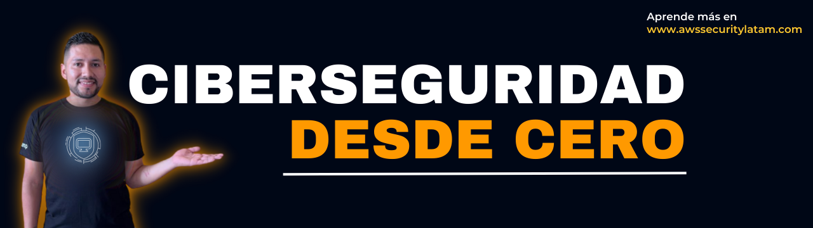

# CIBERSEGURIDAD DESDE CERO
## Da tus primeros pasos en Ciberseguridad sin morir en el intento

### Este curso será transmitido en directo desde el canal de 📺 [Twitch](https://twitch.tv/awssecuritylatam) de la comunidad [AWS Security Community](https://bit.ly/youtube-awsseclatam). Cada Sábado, desde el 29 de Abril, abordaré un dominio de seguridad distinto.

> #### Si te gusta este curso y quieres apoyarme, por favor regalale un "⭐️ Star" al repositorio. Gracias 🙌

## Introducción
Ciberseguridad desde cero es un curso que te ayudara a conocer y comprender las mejores prácticas, políticas y procedimientos fundamentales de seguridad. Al finalizar este curso, serás capaz de demostrar un nivel aceptable de competencia en el campo, sin importar el campo laboral en el que te desempeñas, ni la nula experiencia en esta área. Si te gusta resolver problemas, te motiva ayudar a las personas y te entusiasma el trabajar en un campo en constante evolución, ya tienes mucho en común con los profesionales de ciberseguridad. Esta es la certificación perfecta para tí si quieres iniciar una carrera profesional en esta área.

## Pre-requistos
No hay pre-requisitos para este curso ya que es de nivel introductorio.

## A quién va dirigido
- Estudiantes
- Profesionales recién egresados
- Profesionales de TI
- Profesionales de cualquier área

## Objetivo general del curso
El objetivo general de este curso es que puedas dar tus primeros pasos en ciberseguridad comprendiendo los conceptos que maneja un profesional de esta área en el día a día. Para aprender ciberseguridad es necesario entender cada uno de los dominios que esta tiene, de los cuales, vamos a cubrir solamente cinco de ellos. La idea es no saturar de información a quienes vienen por primera vez e intentan aprender de esta apasionante profesión y que el curso no sea tan largo, ya que su mayor cuota es de conceptoos. ¿Qué seguirá después?, bueno, si el interés a este proyecto es la esperada, podemos hacer un siguiente curso con mas nivel y usando diferentes tecnologias de la industria, todo va a depender de ustedes 😉

## Temario:
Este curso proporciona una revisión integral de los conceptos de seguridad de los sistemas de información, las mejores prácticas de la industria y la terminología, que cubre los cinco dominios que a su vez, son incluidos en el esquema del examen [Certified in Cybersecurity](https://www.isc2.org/certified-in-cybersecurity):

1️⃣ Principios de seguridad

2️⃣ Conceptos de Respuestas a incidentes, Continuidad del negocio y Recuperación ante desastres

3️⃣ Control de acceso

4️⃣ Seguridad de la red

5️⃣ Seguridad de operaciones

## Calendario
> Cada semana aprenderemos un dominio de seguridad distinto

### `PRIMERA CLASE`
#### Sábado 29 de Abril: PRINCIPIOS DE SEGURIDAD
##### Clase en directo por [Twitch](https://twitch.tv/awssecuritylatam). La hora está aún por definir.

### `SEGUNDA CLASE`
#### Sábado 29 de Abril: CONCEPTOS DE RESPUESTA A INCIDENTES, CONTINUIDAD DEL NEGOCIO Y RECUPERACIÓN ANTE DESASTRES
##### Clase en directo por [Twitch](https://twitch.tv/awssecuritylatam). La hora está aún por definir.

### `TERCERA CLASE`
#### Sábado 29 de Abril: CONCEPTOS DE CONTROL DE ACCESO
##### Clase en directo por [Twitch](https://twitch.tv/awssecuritylatam). La hora está aún por definir.

### `CUARTA CLASE`
#### Sábado 29 de Abril: SEGURIDAD DE LA RED
##### Clase en directo por [Twitch](https://twitch.tv/awssecuritylatam). La hora está aún por definir.

### `ÚLTIMA CLASE`
#### Sábado 29 de Abril: SEGURIDAD DE OPERACIONES
##### Clase en directo por [Twitch](https://twitch.tv/awssecuritylatam). La hora está aún por definir.

## Preguntas frecuentes

### ¿Qué utilidad tiene este repositorio?
Aquí, se va a publicar toda la información relacionada con el curso como:
- Calendario de las clases
- Vídeo del directo (una vez finalice en Twitch) 
- Clase editada (una vez se suba a la plataforma que podria ser Youtube o alguna otra, ya aviseremos)
- Enlaces de interés y material de estudio.

### ¿Las clases en directo quedarán grabadas?
Sí, todas las emisiones se podrán ver durante 7 dias posterior a su emisión en [Twitch](https://www.twitch.tv/awssecuritylatam/videos).

### ¿El curso se subirá a YouTube?
Probablemente si. Al decir verdad, estamos pensando subir una version editada a una plataforma en la que podamos dejar quizzes, flash cards, exams, para que puedas poner a prueba tus conocimientos, además de emitir badge digitales y certificados de finalización, ¿te gustaría? Hazmelo saber ❤️ 

> Puedes apoyar mi trabajo haciendo "⭐️ Star" en el repo y/o nominarme a "GitHub Star" 👇

## Hola, mi nombre es Gerardo Castro 👋🏻
Soy Cloud Security Engineer...

### **Te invito a conectar conmigo** 🤝🏻 &nbsp;

### Puedes revisar mi perfil de Github

